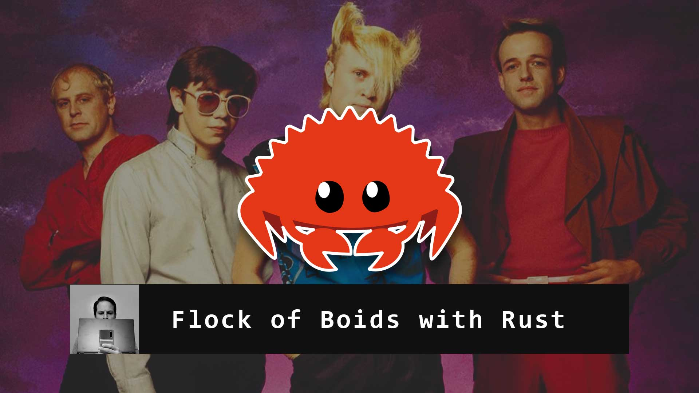
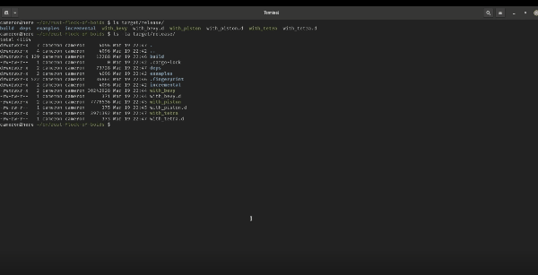

# rust-flock-of-boids
An exploratory look at Rust game engines using the Boids life program

# 

# 

## Description
Using Piston, Amethyst, Tetra, and Bevy, I explore the Rust game dev ecosystem and created thin UI wrappers over a reusable Flocking Boids program to test out some of the top Game Development options available in Rust.

## Version
See [Cargo.toml](Cargo.toml) version

## Platforms / Technologies
* [Rust](https://www.rust-lang.org/en-US/)
* [Cargo](https://doc.rust-lang.org/cargo/)
* [Bevy](https://bevyengine.org/)
* [Piston](https://www.piston.rs/)
* [Amethyst](https://amethyst.rs/)
* [Tetra](https://tetra.seventeencups.net/)

## Run
Note: see [Cargo.toml](Cargo.toml) to swap between Tetra/Bevy due to conflicts of native libraries
>      $ cargo run --bin with_piston
>      $ cargo run --bin with_bevy
>      $ cargo run --bin with_tetra
>      $ cargo run --bin with_amethyst

Another Note: I chose _not_ to use [Cargo Workspaces](https://doc.rust-lang.org/cargo/reference/workspaces.html) due to the format of the video and to keep the code simple and concise.

## Build For Release
>      $ cargo build --bin with_piston --release
>      $ cargo build --bin with_bevy --release
>      $ cargo build --bin with_tetra --release
>      $ cargo build --bin with_amethyst --release
